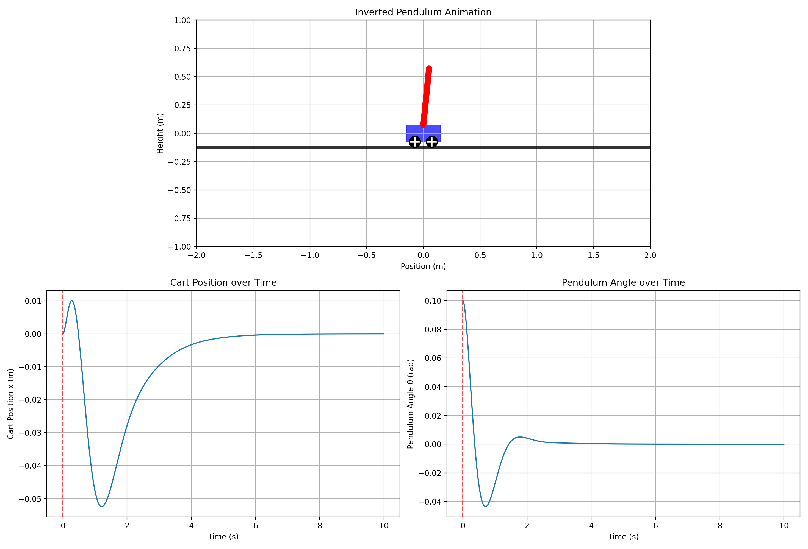

# Inverted-pendulum-control

### Project Overview

This project aims to simulate and stabilize an inverted pendulum system on a moving cart, demonstrating how advanced control techniques can balance an inherently unstable setup—like keeping a broom upright on your hand—through smart, automated adjustments. The ultimate goal is to maintain the pendulum in an upright position despite initial offsets, external disturbances, or sensor inaccuracies, providing a hands-on example of robust control in dynamic systems.

The simulation occurs in 2 dimensions: the cart moves horizontally along a straight line (1D linear motion), while the pendulum swings freely in a vertical plane attached to the cart.

## Animation

*The animation shows the LQR controller stabilizing the pendulum from an initial tilted position back to the upright equilibrium.*

### Parameters

Key parameters include:
- **M**: Mass of the cart (default: 1.0 kg) – represents the base platform's weight.
- **m**: Mass of the pendulum (default: 0.1 kg) – the weight of the rod or bob being balanced.
- **l**: Length of the pendulum (default: 0.5 m) - l/2: distance from joint to center of mass of the pendulum.
- **g**: Acceleration due to gravity (default: 9.81 m/s²) – the constant downward force influencing instability.
- **state**: It is defined as follows:
s = [x, x_dot, theta, theta_dot]
